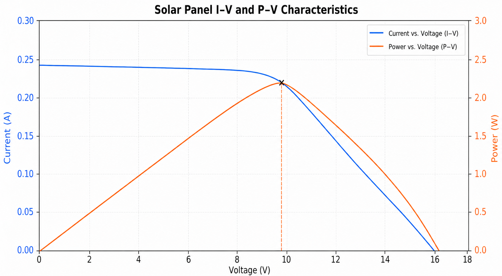

Welcome to the first post in a series about the PixelSat I electrical system.
In this series, we will explore both what we built and also how we arrived there.
If you are new to our mission, we highly recommend checking out our software blog series.

The electrical power system (EPS) of a satellite is akin to the cardiovascular system of a human.
It harvests energy from the solar panels and distributes it throughout the spacecraft to power everything from the radio to the attitude control system.
The EPS must regulate multiple voltage rails and deliver clean, stable power under wildly varying conditions.

In this post, we'll explore the key design decisions and components that make up PixelSat I's EPS: the battery that stores our energy, the maximum power point tracker that maximizes solar harvesting, and the carefully regulated power rails that feed the rest of the satellite.

## Buses
In some ways, we can view the overarching design of the EPS as a very broad optimization problem.
We began designing the system in earnest after finalizing our [STM32 microcontroller](/software-3) and settling on the [EByte E22-400T30D](/software-1) transceiver.
This meant that at the very least we had to have two rails at 5V and 3.3V.

The other main constraint is that we had to prepare for our hand-wound magnetorquers to draw upwards of 2A of current randomly; as such, it made sense to have a third, unregulated rail that drove the torquers.
The calculations are outlined in the [ADCS blog post](/software-2), but we are biased towards higher voltages on this rail.

From this, we settled on a relatively simple architecture:
```
6-8V source --- buck to 5V  --- LDO to 3.3V
     |              |               |
 torquers       transceiver        main
```

## Battery

With this all in mind, we were looking in the 6-8V range for a battery.
We decided to go with a 3p2s lithium-ion battery (each cell being a 21700, a very common and reliable hobby battery),
operating at a nominal voltage of 7.4V. At the moment, we are using a GlobTek battery that matches our specifications,
but in the future we might design a battery pack around the Samsung INR21700-50E cell (six of them, to be exact).
Keep an eye out for a blog post on this if we do!

## MPPT

Solar panels generate electricity with a non-linear relationship between voltage and current, and how much power the panel produces depends on how stressed it is.

Consider a graph of this voltage-to-current relationship.
Now consider the graph of power vs voltage. This can be obtained by multiplying our voltage-current graph by the voltage at each point to get something like the graph below:


We can see that there is exactly one point where the panel delivers the greatest possible power, known as the Maximum Power Point (MPP).
Operating to either side of this peak leaves usable energy on the table.
If the load draws too little current, the panel voltage rises toward its open-circuit voltage while the current falls, resulting in low power output.
On the other hand, if the load draws too much current, the panel voltage collapses, and despite the increased current,
the total power again decreases.

The obvious question is: what determines where the panel operates on this curve, and how do we optimize for power?

The answer is simply the electrical load connected to it.
If a solar panel is connected directly to a battery, the battery effectively dictates the panel's operating voltage.
For example, a fully discharged 2S lithium-ion battery may sit at around 6 V, while a fully charged battery sits around 8.4 V.
If our solar panel's maximum power point is closer to 17–18 V, then directly connecting the panel forces it to operate far away from its optimal point,
potentially wasting a significant fraction of the available solar power.

To avoid this, we insert a regulator between the solar panel and the battery.
Unlike a direct connection, the regulator can present one voltage to the solar panel while simultaneously supplying a sink
at a completely different voltage to the battery.
Since an ideal converter conserves power (aside from efficiency losses), it can draw power from the panel at its maximum power point
while delivering that energy at the voltage required to safely charge the battery.

What we have just defined is a Maximum Power Point Tracker (MPPT) circuit.
Rather than allowing the battery to determine the panel voltage, the MPPT circuit continuously adjusts the internal regulator
so that the solar panel remains operating as close as possible to its maximum power point.
As sunlight intensity changes throughout our orbit or the satellite rotates, the available current changes,
but the MPPT continually adapts to ensure the panel is extracting nearly the maximum possible power.

In our case, we use the [LT3652](https://www.analog.com/media/en/technical-documentation/data-sheets/3652fe.pdf),
which implements a constant-voltage MPPT algorithm.
Instead of explicitly searching for the peak of the power curve, it regulates the panel voltage to a configurable setpoint,
which we choose to coincide with the panel's maximum power point under nominal operating conditions.
For our solar cells, the voltage at the maximum power point changes relatively little with irradiance (around 9.6V),
making this a simple and highly effective approach.
The resistor divider connected to the VIN\_REG pin sets this target voltage, and the controller automatically adjusts the battery charging current
to keep the panel operating at that setpoint.
In addition, once the battery approaches its full charge voltage and the charge current drops below $1/10$th of the programmed maximum,
the LT3652 automatically terminates the charging cycle and enters a low-current standby mode to prevent overcharging.

## The 5V Rail

At this point, we have solved roughly half of the power problem: how we charge the battery. Though the LT3652 is capable of efficiently extracting energy from our solar panels while safely charging the battery, it does not provide a stable voltage for the rest of the spacecraft. The remaining half of the problem is simply: how do we discharge?

The battery voltage naturally varies over its discharge cycle, from approximately 8.4 V when fully charged to around 6 V near depletion. Unfortunately, our transceiver expects a regulated 5 V supply, and feeding it directly from the battery would end badly,
considering that it dies at voltages above 5.5 V.

Therefore, we need a buck converter, a switching regulator that efficiently converts a higher DC voltage into a lower one.
Unlike a linear regulator, which simply burns the excess voltage as heat, a buck converter stores energy temporarily in an inductor before releasing it to the load.
This allows it to achieve efficiencies well above 90% as well as handle much larger voltage differentials.

### Resistors, Capacitor, and Inductors (RCL)

Before we jump into the actual implementation, it's worth taking a second to review the basic components here.

There are three passive components here: Resistors (R), Capacitor (C), and Inductors (L).

A resistor just reduces the flow of current. The voltage is proportional to current: $V = IR$ (Ohm's law).
Any absorbed power is dissipated as heat. 

A capacitor is internally just two conductive plates.
It holds charge proportional to the voltage.
Changing the voltage of a capacitor is more difficult the bigger the capacitance.
This means that capacitors act as voltage stabilizers, which protects against power dips or surges.

An inductor is the mirror image of a capacitor.
It is analogous to a capacitor, except that it holds a magnetic field instead.
Just as a capacitor resists the change in voltage, an inductor resists the change in current

Unlike a resistor, capacitors and inductors do not produce heat.

### Switching regulators

Although switching regulators often appear intimidating, they are fundamentally built from only a handful of components: a switch (mosfet), an inductor, and a capacitor.

When the internal mosfet closes, current flows from the battery through the inductor into the output.
Because an inductor resists rapid changes in current, the current ramps upward gradually while simultaneously storing energy in its magnetic field.

When the mosfet opens, the inductor tries to keep the current flowing.
Since current through an inductor cannot change instantaneously, the collapsing magnetic field generates whatever voltage is necessary to continue driving current into the load.
The path provided by the diode allows this current to circulate until the next switching cycle begins.

By rapidly alternating between these two states hundreds of thousands of times per second,
the converter maintains a nearly constant output voltage despite the switching action itself being entirely digital.

The amount of energy delivered each cycle is controlled by the duty cycle, which is simply the fraction of each switching period during which the mosfet is switched on.

As the battery voltage changes or the load current fluctuates, the controller continuously adjusts the duty cycle to maintain a stable 5 V output.

### LT8610

We use the LT8610 buck converter, a buck regulator capable of delivering up to 3.5 A of output current while operating at efficiencies approaching 95%.

The surrounding circuitry primarily exists to configure the converter and ensure stable operation.

The resistor divider connected to the FB pin determines the output voltage.
The controller continuously compares the feedback voltage against its internal reference and adjusts the duty cycle accordingly.
If the output voltage begins to droop (because we start transmitting, for example), the controller immediately increases the duty cycle,
delivering more energy to the output until regulation is restored.
Similarly, if the load suddenly decreases, the duty cycle is reduced to regulate the output.

The inductor is arguably the most important external component in the entire converter.
Its inductance determines the ripple current, transient response, and operating efficiency.
Choosing one with too little inductance results in excessive current ripple and lower efficiency, whereas too much inductance
slows the converter's response to quickly spiking loads and unnecessarily increases size, mass, and electromagnetic interference.

## The 3.3V Rail

With a stable and efficient 5 V rail now available, producing the final 3.3 V supply for the control electronics becomes dramatically simpler.
Rather than using another buck converter, we simply use an LDO (Low Dropout Regulator).

Unlike switching regulators, linear regulators contain no inductors, no switching MOSFETs, and no complex feedback compensation networks.
Instead, they operate much like a variable resistor placed in series with the load.
Our regulator continuously adjusts the resistance of an internal pass transistor such that the output remains fixed at 3.3 V
regardless of changes in load current or input voltage.

The downside of this is that any voltage drop across the LDO is simply released as heat, given by the equation $P=I_{\text{load}}\Delta V$.
In our case, stepping down from 5V to 3.3V, we must constantly dissipate $1.7 \cdot I_{\text{load}}$.
Thankfully, our mains draw never exceeds a few hundred milliamps (and that at higher levels of operation),
which is why we are comfortable using an LDO here.

### Ripples and flux

The main advantage of an LDO is the quality of its output. Because it contains no high-frequency switching elements,
it introduces virtually no switching ripple of its own and provides excellent rejection of the residual noise
produced by the upstream buck converter. While the LT8610 already produces a well-regulated 5 V rail,
every switching regulator generates some output ripple as it rapidly switches current through its inductor.
The LDO effectively acts as a final cleanup stage, getting rid of all the remaining noise before it reaches the control electronics.

This is especially important for our analog peripherals such as the photodiodes. 
The STM32's analog-to-digital converters, reference voltages, and sensor interfaces all benefit from a clean supply rail,
reducing measurement noise and improving overall system stability.
Even for purely digital logic, eliminating unnecessary supply ripple makes signals much easier to process
and reduces the chance of random things happening under load.

Thankfully, the circuitry surrounding the LDO is quite trivial.
Other than the LDO itself, only an input capacitor and an output capacitor are required to ensure stable operation and provide local decoupling.
After designing the MPPT circuit and the scaffolding for the buck converter, designing this was refreshingly easy.

## Interference and decoupling

You might have noticed by now that we appear to be sticking capacitors in random places. This is not accidental.
First and foremost, capacitors are essential in keeping high-speed switching regulators stable and preventing them from interfering
with the rest of the satellite's electronics. The LT3652 and LT8610 switch several amperes of current hundreds of thousands of times per second,
producing extremely sharp edges on the voltage/time and current/time graphs.
Without careful filtering, all this switching noise would propagate throughout the power distribution circuitry and flow into nearby circuitry.

One of the first things we designed is the collection of input and output capacitors surrounding each switching regulator.
The input capacitors provide the large, rapidly changing switching currents locally, preventing the current spikes drawn during switching from propagating throughout the battery bus.
Similarly, the output capacitors smooth the ripple produced by the switching action and provide energy during sudden load spikes before the controller has time to adjust its duty cycle.

There are some more specialized capacitors. A small bootstrap capacitor provides the gate drive required for the high-side MOSFET.
Since the mosfet's source terminal rises nearly to the input voltage when it turns on, its gate must briefly be driven to an even higher voltage in order to fully enhance the device.
The bootstrap capacitor stores charge while the low-side switch is conducting, then uses that stored energy to drive the high-side gate during the following switching cycle.

Finally, the compensation network determines and regulates the frequency response of the feedback loop. Rather than allowing the controller to aggressively chase every tiny voltage fluctuation,
it makes sure the regulator responds quickly while remaining stable. Without proper compensation,
the output voltage would oscillate instead of smoothly converging back to its desired value as the regulator tried to overcorrect.

### Decoupling capacitors

Throughout our PCB you might notice numerous 100 nF ceramic capacitors placed immediately adjacent to nearly every integrated circuit. These are the decoupling capacitors.

Integrated circuits rarely draw perfectly constant current. Every clock cycle inside the STM, for example, causes a sharp edge in our current draw.
If these currents had to travel all the way from the battery, the inductance of the power distribution network would create unwanted voltage fluctuations according to


$$
V = L \frac{\text{d}I}{\text{d}t}
$$

Instead, each ceramic capacitor acts as a tiny local battery, supplying these high-frequency current spikes directly to the IC sitting only a few millimeters away.
After the transient passes, the capacitor recharges from the main power rail.

This is why decoupling capacitors are placed physically adjacent to the power pins of each IC.
Their effectiveness depends more on minimizing trace inductance than on the exact capacitance value.
A perfectly sized capacitor located several centimeters away is often less useful than a smaller one placed immediately beside the device.

### PCB layout

When designing power electronics, especially with switching components, we have to keep PCB layout in mind at all times.
Though the schematic is important, the circuit will not work unless we are vigilant about our trace length and layout.

Every high-current switching path forms a loop, and every loop behaves like a small antenna/electromagnet.
Larger loops radiate more electromagnetic interference while simultaneously being more susceptible to external noise.
Consequently, high-current switching loops should be kept as physically small as possible,
with input bypass capacitors located immediately adjacent to the switching regulator.

Similarly, all high-current traces must be made sufficiently wide to minimize resistive losses and voltage drop,
while a continuous ground plane provides a low-impedance return path for switching currents.
