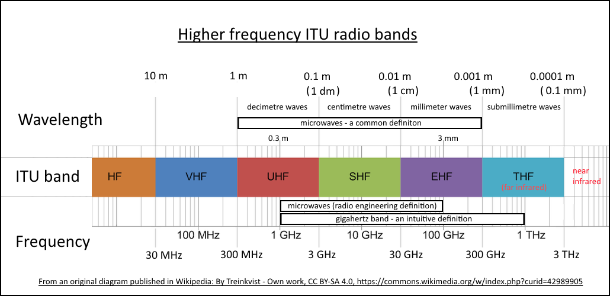
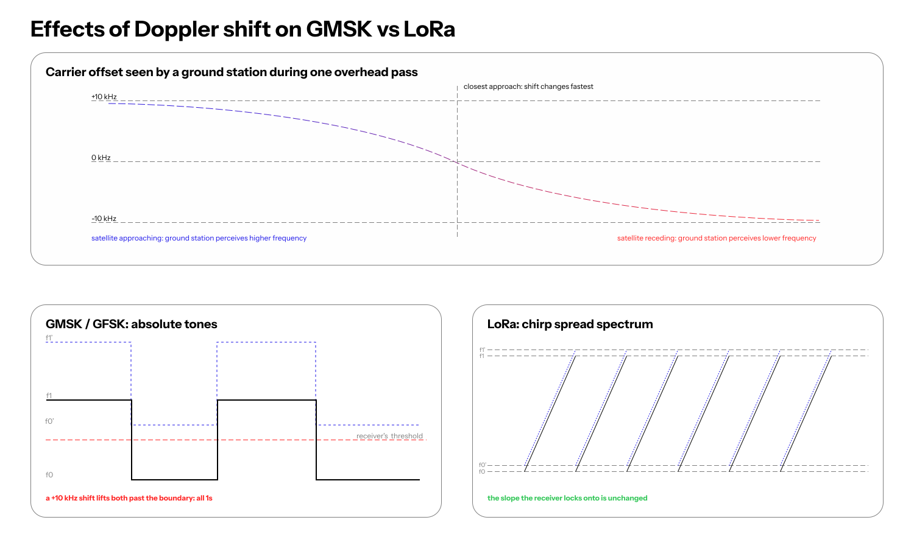

<!--
### Outline

- Constraints
  - Large link budget
  - Very low cost
  - Relatively low power
  - Small footprint
- UHF
- LoRa vs GMSK/GFSK
  - LoRa
  - GMSK/GFSK
  - Handling Doppler shift (us being dumb with GPS)
- Ground stations
- Encryption & Regulation
- Quadratic Model & RSSI
- Framing
  - AX.25
  - CSP
  - HDLC
- Low cost blah blah blah
- Timeline
  - AX1000
  - Cormorant
  - Various SX-series transceivers considered
      - SX1272
      - SX1278
      - SX1268
      - SX1262
    - The pains of TCXO
  - EBYTE E22-400T30D (has TCXO, wraps SX1262)
    - `AT+UFREQ` pain
    - Power budget
    - Link budget
- Current comms framing etc
- comms serialization macros stuff
-->

Welcome to the first post in a series about the PixelSat I software stack.

PixelSat I is a 3U CubeSat designed entirely by students at Stanford OHS and is scheduled to launch no earlier than March 2027.

## Constraints
When choosing a transceiver, there were a few constraints we absolutely had to satisfy.

Firstly, the transceiver could not be expensive. Ideally, it had to cost under $500 after discounts.

Secondly, we needed something with a large link budget. Due to the nature of our satellite, we cannot guarantee precise orientation.

Thirdly, we needed something with a relatively low power draw. We needed a transceiver that could run at around 8 V and draw no more than 200–300 mA.

Lastly, the transceiver had to physically survive in a CubeSat: it needed to be small and able to handle radiation and temperature cycling.

## UHF



UHF is the ideal band for communications at this scale because of its low power requirements, ease of manufacturing (which implies lower cost), and decent bandwidth.

Compared to VHF, UHF is less affected by the ionosphere, has a smaller antenna footprint, and offers much more bandwidth.

S-band and X-band do not have cheap, readily available COTS transceivers, and their power draw is also higher to compensate for signal loss.

## LoRa vs GMSK/GFSK

### LoRa

LoRa operates by transmitting each symbol as a frequency sweep (described as a "chirp"). Because of this, LoRa signals are very resistant to interference and can transmit over long ranges. However, the occupied bandwidth of a LoRa signal is quite large, which means its spectral efficiency is low. LoRa's data rate is also much lower than that of GMSK/GFSK.

### GMSK/GFSK

#### FSK (frequency shift keying)
FSK simply switches the frequency of a carrier wave between a set of discrete frequencies. For example, in BFSK (binary FSK), we might have a specific frequency for 0s and another for 1s, and the receiver determines which frequency is present during each symbol period and decodes the bit.

#### GFSK (Gaussian FSK)
GFSK simply applies a Gaussian filter to the input data before frequency modulation, smoothing transitions between symbols. This reduces out-of-band emissions and occupied bandwidth compared to plain FSK while maintaining the same basic modulation scheme. The resulting signal is more spectrally efficient and supports higher symbol rates in a given band.

#### GMSK (Gaussian minimum shift keying)
GMSK is a special case of GFSK in which the modulation index is minimized while still allowing symbols to be distinguished easily. Relative to plain GFSK, it still requires a bit more processing.

### Handling Doppler shift
**Doppler shift** is the apparent carrier-frequency shift due to the velocity difference between the transmitter and the receiver. If the transmitter is moving toward the receiver, the received frequency appears higher than the transmitted frequency, and vice versa.

Because LoRa uses chirp spread spectrum, it is generally more tolerant of Doppler-induced frequency offsets than GMSK/GFSK, which rely on detecting small frequency changes around the carrier wave. Therefore, GMSK/GFSK requires accurate knowledge of the satellite's position and velocity to decode the signal reliably.



Due to Doppler shift and our design constraints, we eventually settled on a pure LoRa communications stack.

## Timeline

We considered an inordinate number of transceivers throughout this project before settling on the EByte E22-400T30D LoRa module in May 2027.

### GomSpace AX100
The GomSpace AX100 is a UHF/VHF transceiver used in many CubeSat missions. It operates with GMSK/GFSK, supporting configurable data rates and forward error correction. We first considered it because of its extensive flight heritage and the prevalence of GMSK ground stations. However, after talking to GomSpace, we were unable to get a quote below $10k for a single transceiver, which pushed us to our next option.

### Needronix Cormorant
The Cormorant is another UHF/VHF CubeSat-first transceiver that interfaces over the PC/104 bus. It promises low power consumption, has extensive flight heritage, and supports various framing protocols such as CSP. It also includes internal bit-flip correction and reset mechanisms, RSSI measurement, and various other features. Unfortunately, we were priced out of this option as well.

It was around this time that we first seriously considered LoRa. This opened up an entirely new ecosystem for us, one that was significantly more affordable and better documented.

### Semtech SX-series transceivers
The Semtech SX-series is a family of UHF transceivers that support both LoRa *and* GFSK. The SX-series transceivers were initially designed for high-volume, low-power IoT applications, which is where their affordability stems from. Various CubeSat missions, such as the Stanford SAMWISE mission and multiple FossaSat missions, used SX-series transceivers with LoRa (either wrapped by a COTS module or just the bare transceiver) for their comms stack, and those missions were all well documented and had used the transceiver successfully.

The only problem with this approach was the TCXO. A TCXO (temperature-compensated crystal oscillator) is a key component of most transceivers, providing a stable frequency reference. In space, temperature fluctuations can cause a standard crystal oscillator (like the one packaged with raw SX-series modules) to drift significantly, potentially jeopardizing the link. In the past, many satellites custom-designed their transceiver boards to integrate a TCXO, but we decided that this was impractical since it would just be an additional point of failure.

Speaking of points of failure, this was also when we decided, after many discussions, to fully commit to a pure LoRa stack for two reasons. First, given our expected usage—at most one or two low-resolution JPEGs transmitted per day—there was no compelling reason to use GMSK. Second, constantly switching between LoRa for light tasks and GMSK for heavier tasks could prove problematic.

### EByte E22-400T30D

The EByte E22-400T30D is a pure LoRa transceiver that wraps everything we want: an SX1262 transceiver module with a TCXO, nice I/O, and 3.3 V logic. Though we could not find exact flight heritage for the module, the success of previous thoroughly vetted SX-based modules in CubeSats, along with the advice of many experts, convinced us to choose it as the final transceiver for the satellite.

#### `AT+UFREQ` pain
The EByte module operates on 83 channels, with a base frequency of 410.125 MHz. On channel 25, we should theoretically get a frequency of 435.125 MHz, which is close to the amateur radio band we are permitted to use. However, to conform to regulations, we must transmit and receive at exactly 435 MHz. To do this, we need to use the `AT+UFREQ` command, but according to the manual, "Detailed documentation for instruction operations is available through EBYTE sales channels." We reached out to EByte but have not received a response, so we reverse-engineered our best interpretation from the manual for the EWM226-900H30S.

For reference, that guide uses this example:

```
AT+UFREQ=1,868000000,500000,50
AT+CHANNEL=10
```

EBYTE explains that `AT+UFREQ=1,868000000,500000,50` configures the start frequency, channel spacing, and channel count for fixed-frequency transmit/receive operation. It then says `AT+CHANNEL=10` selects `FREQ = 868000000 + 500000 * 10 Hz`. The best-supported public interpretation is therefore:
```
AT+UFREQ=<enable>,<start_hz>,<spacing_hz>,<channel_count>
FREQ_Hz = start_hz + spacing_hz * channel
```

We still need to verify this with dedicated RF hardware.

## Ground Network

UHF also has strong ground network support: the SatNOGS and TinyGS networks provide worldwide downlink connectivity for amateur satellites like ours.

Due to regulations, these networks generally cannot provide uplink connectivity; however, specific operators might be able to provide it on a case-by-case basis.

SatNOGS supports VHF, UHF, and S-band and is more widely used. It additionally supports a variety of modulation schemes, including LoRa and GMSK.

Meanwhile, TinyGS has a lower station cost and is more accessible to hobbyists, but it only targets UHF LoRa.

## Current Comms Framing

At the moment, we use a custom framing method. Due to regulatory requirements and ground network constraints, we encrypt uplink transmissions via AES-GCM and leave downlink transmissions unencrypted.

All packets start with an 8-byte magic string. The downlink magic is `PIXELSAT`. This is followed by a 4-byte CRC32 checksum of the rest of the packet.

The payload follows this header. For uplink packets, a 12-byte nonce is inserted after the header and before the data.

We periodically transmit heartbeat packets. These are the packets primarily sent through the ground network.

Most other operations happen when a ground station uplinks a request to the satellite. The request is acknowledged by the satellite, then processed, and the result is returned to the ground station.

## Message Formatting

Due to the large number of messages we need to transmit, we use custom derive macros to automatically generate serialization and deserialization code for our message types.

These macros are custom-built, allowing us to achieve the following goals:

1. No heap allocations
2. Maximum packing efficiency

For example, we pack boolean values as single bits to minimize packet size.

The following code, for example, occupies 1 byte:
```rust
#[derive(CommsSerialize, CommsDeserialize)]
pub struct Example {
    pub imu_up: bool,
    pub mag_up: bool,
    pub temp_up: bool,
    pub cam_up: bool,
    pub has_tle: bool,
}
```