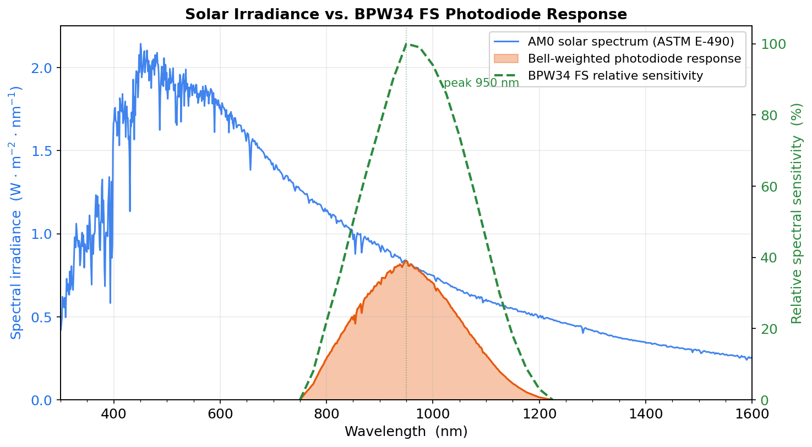
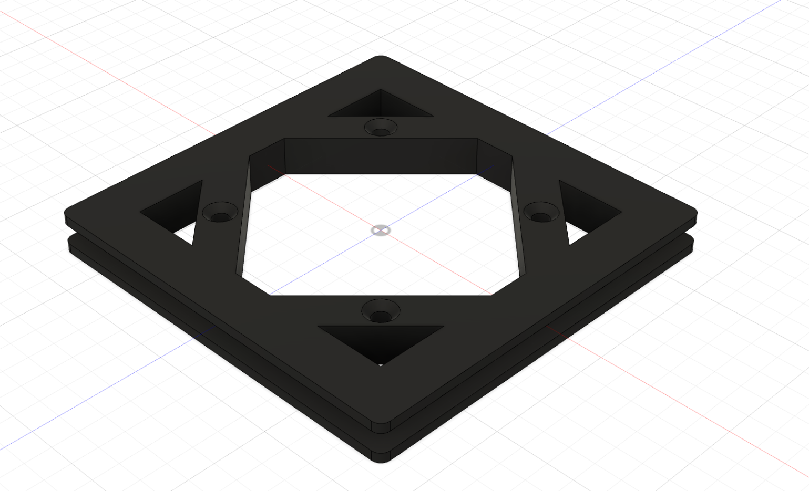

Welcome to the second post in our series about the PixelSat I software stack. If you haven't read [Part 1](/software-1) on our comms system, we'd recommend starting there for context on the mission.

## Attitude Determination and Control System

Put simply, ADCS is the subsystem that answers two questions continuously throughout the mission: "Which way is the satellite currently pointing, and how fast is it rotating?" (determination) and "What do we need to do to point it somewhere else, or stop it from tumbling?" (control).

Like comms, ADCS is a subsystem where the "correct" solution used on larger missions (star trackers, reaction wheels, etc.) is completely out of reach for our budget. So a lot of this post is about the tradeoffs we made to get a working attitude system out of cheap, noisy, and somewhat sparse sensors.

## Constraints

We cannot use reaction wheels or control moment gyroscopes.
On most higher-cost satellites, these are widely used, since they let you apply torque in any direction independent of your environment as well as simply generate much more torque.
However, due to the fact that they are a) expensive b) extremely mechanically complex (we're trying to keep moving parts off this satellite) and c) draw power we don't have to spare, we committed early to magnetorquers only.
Magnetorquers are wonderfully simple, provided you are comfortable letting Earth’s magnetic field participate in every steering decision.

We cannot use a star tracker either. We  have neither the (cost) budget to get one (they require extremely good optics) nor the computing budget to process their data. 

Finally, sensors need to be cheap, low power, and easy to interface with over standard buses (I2C, SPI) from our onboard computer.

Given those constraints, our sensor suite ended up being:

- **Coarse Sun Sensor**: six photodiodes, one on each face of the satellite (+X, -X, +Y, -Y, +Z, -Z). Individually crude, but together they let us reconstruct a body-frame sun direction whenever the sun is visible.
- **Magnetometer** (PNI RM3100-CB): gives us a body-frame measurement of Earth's magnetic field, which we compare against a reference field.
- **Gyroscope**: gives us angular velocity directly, and is the main sensor for short-timescale attitude propagation.

Our sole actuator is a set of three orthogonal magnetorquers, which produce a magnetic dipole that reacts against Earth's local magnetic field to produce torque.
However, magnetorquers have one major drawback: they cannot generate arbitrary torques.
A magnetorquer produces a magnetic dipole $m$, which interacts with Earth's magnetic field $B$ according to

$$
\tau=m\times B,
\qquad
\tau\cdot B=0.
$$

Since the torque is always the cross product of these vectors, it is necessarily perpendicular to the local magnetic field. At any instant there is therefore one direction in which the spacecraft simply cannot produce torque.

Additionally, due to only having three magnetorquers, the strength of the produced magnetic dipole varies due to per-axis saturation.

Our system chooses the closest possible dipole direction to the desired torque direction. We solve this in a few ways, outlined later.

## Attitude Determination System

### Why an EKF

We have two very different kinds of sensor information to reconcile.

The gyro gives us a relative, high-rate measurement of angular velocity. However, it drifts over time, and can't give us a stable reference: it gives us velocity, not position.

The sun sensor and magnetometer, on the other hand, give us absolute vector references, but at a lower rate and lower individual accuracy.
For example magnetometer readings are not taken while we are applying torque from the magnetorquers, as that heavily affects the readings.
Reading the magnetometer while running the magnetorquer would be a bit like checking a compass while holding a magnet right next to it.
Instead, we have to temporarily pause the magnetorquers every 500 ms to take a reading.
And while the coarse sun sensor is not affected by this, it remains far less accurate than either the magnetometer or the IMU.

The EKF combines these complementary measurements.
An EKF allows you to fuse a fast, drifting relative sensor with slower absolute references, weighted by how much you trust each one at any given moment.
"Extended" just means we linearize the (inherently nonlinear) attitude dynamics around our current best estimate at every step, rather than assuming everything is linear like a textbook Kalman filter would.

More specifically, the current implementation is a multiplicative error-state EKF.
What this means is that instead of tracking the full attitude as a linear filter state, we propagate the nominal attitude on its own using proper nonlinear quaternion kinematics, and let the Kalman filter only track a small, linearizable error on top of that nominal estimate.
During every update cycle, that small error correction gets folded multiplicatively into the nominal quaternion, and the error state resets back near zero.

### Attitude representation

Internally, the estimator propagates attitude as a unit quaternion.
Quaternions avoid singularities, compose efficiently, and are the standard representation for spacecraft dynamics. 

Other software components, however, work more naturally with a minimal three-parameter representation.
For those interfaces, we convert the output quaternion into Modified Rodrigues Parameters (MRPs).

$$
q
=
\begin{bmatrix}
q_0 \\
q_v
\end{bmatrix},
\qquad
q^{\mathsf T}q=1,
\qquad
\sigma
=
\frac{q_v}{1+q_0}.
$$

Because MRPs have a singularity at a full 360° rotation, we map the MRPs into the shadow set, which is simply an alternate MRP representation of the same physical orientation that stays well-behaved exactly where the primary representation blows up.

$$
\sigma^{S}
=
-\frac{\sigma}
{\sigma^{\mathsf T}\sigma},
\qquad
\lVert\sigma\rVert>1.
$$

Our estimator always checks the magnitude of the current MRP vector and swaps to the shadow set whenever it would otherwise approach that singularity, so the reported attitude never becomes numerically unstable in flight.

### Position propagation

Our sun sensor and magnetometer measure vectors in the spacecraft's body frame.
To compare those measurements against reality, we need to know what those vectors should look like in inertial space.

To do this, we have to propagate the orbit from what we know (i.e. some initial parameters we've uplinked) to the current position.

Before we joined the project, the team was considering propagating the orbit using classical Keplerian elements. Unfortunately, Earth refuses to cooperate by behaving like a perfect sphere.
The Earth is not a simple point mass; its gravitational field has extra terms (the zonal harmonics $J_2$, $J_3$, $J_4$) that steadily rotate our orbital plane and argument of perigee.
On top of that, our orbit is low enough that the residual atmospheric drag measurably shrinks our orbit even over a few weeks.
Most importantly, a TLE encodes the *mean motion* of the satellite, which poses problems when the motion of the satellite is nonuniform.

The SGP4 (Simplified General Perturbations 4) model solves all these problems compactly by folding both gravitational perturbations and a drag model into a closed-form propagator (no need to numerically solve ODEs, for example...).

Our implementation of the model follows [Vallado's excellent description of SGP4](https://celestrak.org/publications/AIAA/2006-6753/). We split the propagator into a one-time initialization from the TLE and a cheap `propagate(t)` call for any later time:

**Initialization:**

- Recover the "true" mean motion $n_0''$ and semi-major axis $a_0''$ that the rest of the algorithm actually works with from the TLE's mean motion
- From the recovered perigee height, decide whether the orbit needs the full drag-perturbation terms or can use SGP4's simplified branch for very low perigees (under 220 km)
- Derive the drag coefficients from BSTAR
- Compute the secular drift rates for mean anomaly, argument of perigee, and RAAN driven by $J_2$ and $J_4$
- Precompute the long-period $J_3$ coefficients that capture Earth's north/south asymmetry
- Compute some remaining time-polynomial coefficients reused during each propagation

**Propagation:**

- Advance mean anomaly, argument of perigee, and RAAN using the secular rates from initialization over the elapsed time since epoch
- Apply the drag-driven corrections to semi-major axis, eccentricity, and mean longitude built from the BSTAR-derived coefficients above
- Add the small $J_3$ long-period correction to the eccentricity vector
- Solve Kepler's equation for the eccentric-anomaly-like variable via a damped Newton iteration (capped at 10 steps, which converges comfortably in practice)
- Apply the short-period $J_2$ corrections back onto radius, argument of latitude, RAAN, and inclination
- Convert the corrected elements into a Cartesian position and velocity using the standard perifocal basis vectors, giving us a state in the TEME frame

TEME (True Equator, Mean Equinox) is SGP4's native output frame, and though it is not exactly the same as a true inertial frame like J2000 (TEME has a small precession offset we currently treat as negligible) it works well enough for us to use directly with our sun/magnetometer reference-vector comparisons. 
From the TEME position we compute GMST from the current UTC time, rotate into ECEF, and convert to geodetic latitude/longitude/altitude over WGS84 for ground-station pass prediction and the EKF's reference vectors.

### Coarse sun sensor

Each of the six faces carries a single OSRAM BPW34 FS photodiode. The FS variant has a daylight-blocking filter built in; it is essentially blind to visible light and only responds from roughly 780 nm to 1100 nm, peaking near 950 nm in the near-infrared. This is actually a feature for us, since it makes the sensor far less sensitive to albedo, which is one of the largest error sources for a coarse sun sensor.

We use the photodiode in reverse-biased (photoconductive) mode: we tie the cathode to a bias rail (3.3 V) and let the photocurrent flow through a load resistor $R$ to ground. The photodiode behaves like a current source whose output is proportional to the incident light, so the voltage the analog pin actually reads is simply

$$
V = I_p R .
$$

When the sun is directly normal to a face, $I_p$ is at its maximum, and as the face tilts away the current falls off following a cosine law,

$$
I_p(\theta) = I_{p,\text{max}}\cos\theta .
$$

Comparing the six faces against each other lets us reconstruct a body-frame sun vector. However, to pick the resistor we first need to know how much current full sun in LEO actually produces.

We aim to find the short-circuit photocurrent produced by the diode under full sunlight in orbit. Getting it wrong in one direction pushes far too much voltage into our OBC; getting it wrong in the other wastes most of our dynamic range.

As far as we are concerned there is no atmosphere, so the relevant spectrum is AM0 (air mass zero). We use the standard [ASTM E-490](https://www.nrel.gov/grid/solar-resource/spectra-astm-e490) reference spectrum, which gives spectral irradiance $E(\lambda)$ in $\text{W}\,\text{m}^{-2}\,\text{nm}^{-1}$.

However, the diode does not convert every wavelength equally. Its spectral responsivity $S(\lambda)$, in amps of photocurrent per watt of incident light, is the datasheet's relative spectral sensitivity curve (a bell shape peaking at 950 nm) scaled by the peak responsivity $S_\text{peak} = 0.7\ \text{A/W}$:

$$
S(\lambda) = S_\text{peak}\, s_\text{rel}(\lambda).
$$

Only the part of the solar spectrum that falls under this bell curve generates current. We multiply the AM0 spectrum by the responsivity curve point-by-point and integrate. Visually, the photodiode only sees the shaded region in the graph below.

Notice that even though the solar spectrum peaks in the visible (around 450–500 nm), the filtered photodiode throws all of that away and only harvests a slice of the near-infrared tail. Of the ~$1366 \text{W/m}^2$ of total sunlight, only about $193 W/m^2$ of irradiance is available to the sensor.

The current density is the weighted integral, and the total photocurrent is that density times the radiant-sensitive area of the die, $A = 7.02\ \text{mm}^2$:

$$
I_p = A \int_{\lambda_1}^{\lambda_2} E(\lambda)\, S(\lambda)\, d\lambda .
$$

Evaluating this integral numerically gives

$$
I_{p,\text{max}} \approx 0.95\ \text{mA}
$$

at full normal-incidence sun.

The photodiode feeds a 16-bit ADC on the STM32 whose reference is 3.3 V. We want full sunlight at normal incidence to swing the ADC close to full-scale (to use the whole dynamic range) but *never* clip. Solving $V = I_p R$ for the resistor:

$$
R = \frac{V_\text{FS}}{I_{p,\text{max}}} = \frac{3.3\ \text{V}}{0.95\ \text{mA}} \approx 3.5\ \text{k}\Omega .
$$

We round down to a standard $3.3 k\Omega$ resistor, which puts a full sun at roughly $0.95\ \text{mA} \times 3.3\ \text{k}\Omega \approx 3.1\ \text{V}$. Because the diode is reverse-biased, it stays in its linear current-source region across the whole range (unlike an unbiased photovoltaic setup, where the ~$0.4 V$ open-circuit ceiling of silicon would make a swing this large impossible).

## Attitude Control System

### Overview
The attitude controller simply takes in the estimated attitude and the angular velocity coming out of the EKF,
as well as a specific mode and profile to execute.

We have 3 attitude control system modes: omega kill, reference attitude tracking, and ground point tracking.
The controller then outputs a commanded body torque.
As noted earlier, this torque often cannot be executed perfectly since we can only torque around a vector orthogonal to the local magnetic field line.

<!-- https://www.sciencedirect.com/science/article/pii/S1474667017589156 -->

#### Omega kill

This is the simplest mode, where the controller simply stops the satellite from rotating.

This is very useful immediately after launch: at this time the satellite is rapidly rotating and does not know anything about the current time or its TLE, so we are unable to use the sun sensors or the IGRF. As such, we simply use the famous B-dot control law:
$$
\mathbf{m} = -k \dot{\mathbf{B}}
$$
where $\dot{\mathbf{B}}=\frac{\mathrm{d}\mathbf{B}}{\mathrm{d}t}=\frac{\Delta \mathbf{B}}{\Delta t}$ (which we *can* measure with our magnetometer)
to generate magnetic moments that are always orthogonal to the local magnetic field (since $\mathbf{B} \perp \dot{\mathbf{B}}$).
This ensures that our detumble is rapid and that we are not wasting any power on un-executable torque profiles in the most power-draw-intensive part of the flight.

#### Reference attitude tracking

During nominal operations, PixelSat maintains a nadir-pointing attitude, keeping its antenna directed toward Earth.
This maximizes communication performance over the majority of each orbit while also providing a consistent reference frame for the rest of the spacecraft.

Additionally, we can adjust this attitude as needed to take pictures.

We use a PID controller to generate our commanded torque here.
As previously noted, we are always unable to torque along the axis of the local magnetic field, but the controller intrinsically corrects for that and will eventually stabilize.
We are also exploring LQR options (keep an eye out for a future blog post!).

#### Ground point tracking

When communicating with one of our ground stations, we can do even better than simply pointing.

Rather than pointing toward Earth's center, the controller computes the line-of-sight vector to the selected ground station from the spacecraft's current orbit estimate.
The same feedback controller is then used, but with this continuously changing reference attitude.

This allows the antenna's main lobe to remain aligned with the receiving station throughout the pass, improving the available link margin.

### PID

For PixelSat's relatively slow dynamics and limited actuator authority, a well-tuned PID controller provides excellent performance without introducing the complexity of more advanced nonlinear control techniques.

The controller simply outputs a weighted sum of the **P**roportional, **I**ntegral, and **D**erivative terms. More specifically:
- **Proportional**: the proportional term takes the attitude error
- **Integral**: the integral term accumulates the attitude error over time
- **Derivative**: the derivative term takes in the angular velocity error (to provide damping)

As an equation:

$$
\omega_e = \omega-\omega_d,
\qquad
\tau_c = -K_p\ e -K_d\ \omega_e - K_i\ \int e\,dt.
$$

We clamp the integral term to prevent windup; without this if a large error appears the integral term will accumulate to gigantic proportions and would overshoot badly.

### Magnetorquer Design

A magnetorquer is, at its core, just a coil of wire: run current through it and it produces a magnetic dipole $m$, which reacts against Earth's field $B$ to make torque $\tau = m \times B$. The design question is how to build a coil that produces as large a dipole as possible within our power and volume budgets.

#### Calculating dipole

Take a single square coil with side length $s$, so its enclosed area is $A = s^2$, wound with $N$ turns of magnet wire that has resistance $\lambda$ per unit length. Driven at bus voltage $V$, its magnetic dipole moment is

$$
m = N \cdot I \cdot A .
$$

The total length of wire is (perimeter)$\times$(turns) $= 4Ns$, so its resistance is $R = 4 N \lambda s$ and the current is $I = V/R = V/(4N\lambda s)$. Substituting back:

$$
m = N \cdot \frac{V}{4N\lambda s} \cdot s^2 = \frac{V s}{4\lambda}.
$$

We see that the number of turns $N$ cancels out entirely. At a fixed drive voltage, adding turns increases the dipole-per-amp but raises resistance and cuts the current by exactly the same factor. This has a slightly counterintuitive consequence: **turns buy us no torque authority at all.** Every winding produces the same dipole at a given bus voltage, so we cannot wind our way to a stronger torquer. What $N$ *does* control is power: since $P = V^2/R = V^2/(4N\lambda s)$, more turns means less current and therefore less power dissipated for the same dipole. (In practice we don't have perfectly square corners; rounded corners shave the constant slightly, to something closer to $Vs/(3.8\lambda)$, but that's a small correction.)

#### Design

We want to maximize the number of turns we use to reduce power consumption (since $P=V^2/R$), but if we have too many, our current sensing becomes challenging.

Those bounds leave a wide window, so we apply the time-honored aerospace optimization technique of choosing a comfortably round number: 100 turns.
We drive the coils from the unregulated bus (more to come on this in our first electrical blog post), nominally 7.2 V (though this sags and varies with battery state of charge). Using AWG-42-class magnet wire (0.066 mm diameter copper with $\lambda \approx 4.9\ \Omega/\text{m}$) on a coil roughly $s=8\ \text{cm}$ per side, the dipole works out to

$$
m = \frac{V s}{4\lambda} = \frac{7.2 \times 0.08}{4 \times 4.9} \approx 0.029\ \text{A·m}^2 .
$$

At 100 turns, the coil resistance is $R = 4N\lambda s \approx 157\ \Omega$, draws $\approx 46\ \text{mA}$, and dissipates only $\approx 0.33\ \text{W}$ per torquer (about 1 W across all three). This is a small enough slice of our generation that it does not eat into our power budget significantly. We could wind more turns to shave the power further, but below a few tenths of a watt it stops mattering to the energy budget while the current drifts toward our sensing floor.

Physically, each torquer is a copper winding around a central rectangular bobbin, with guardrails on the top and bottom edges so the wire cannot slip off during winding or launch vibration.

#### Driving the coil

Open-loop PWM alone would not be good enough here. The coil's resistance climbs as the copper heats up, and the bus voltage itself drifts with battery state, so a fixed duty cycle would produce a drifting, unpredictable dipole. Instead we close the loop: a current monitor IC measures the actual coil current and the STM32 adjusts PWM to hit the commanded value.

Of course, the STM32 also cannot source the coil voltage or reverse polarity on its own, and we need both directions to torque either way about an axis. So each coil is driven through an H-bridge, which is simply an arrangement of four MOSFETs that let the controller flip the full bus voltage across the coil in either direction, giving us a signed, closed-loop-regulated dipole on every axis.

## Conclusion

The ADCS provides an excellent fusion of 3 sensors, each of which has their own pros/cons.
This ensures that we can have accurate pointing at all times.

In doing so, it provides excellent pointing accuracy at a surprisingly low cost.

Of course, the disadvantages are visible:
we cannot always make highly precise corrections, and our attitude estimates have approximately 1° of error.

Thank you for reading to the end! The next post in the software blog series will be about the Onboard Computer.
